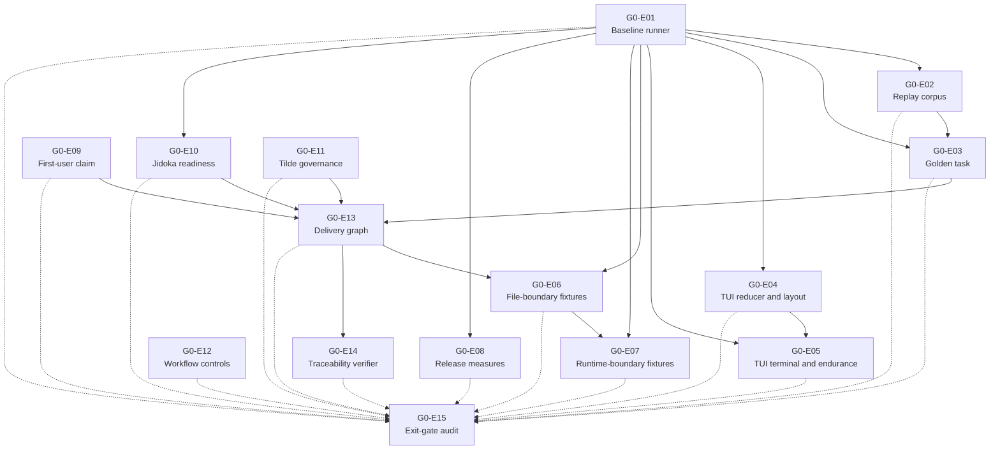

# Gate 0 Epics

These epics split Gate 0 into reviewable delivery units. Each epic is complete in exactly one pull request. A pull request must not combine two Gate 0 epics.

The epic files define scope, epic dependencies, acceptance checks, and proof. Beadwork owns implementation tasks, owners, task dependencies, estimates, and delivery status. Use `bw show <beadwork-id>` to open an imported epic.

## Epic Order

| Epic | Beadwork ID | One-pull-request result | Depends on |
| --- | --- | --- | --- |
| [G0-E01 Baseline evidence runner](g0-e01-baseline-evidence-runner.md) | `jido_console-g0e01` | One repeatable runner compares two isolated clean baselines. | None |
| [G0-E02 Recorded replay corpus](g0-e02-recorded-replay-corpus.md) | `jido_console-g0e02` | Redacted records replay without a paid model call and report divergence. | G0-E01 |
| [G0-E03 Golden coding task](g0-e03-golden-coding-task.md) | `jido_console-g0e03` | One versioned coding task becomes the fixed Milestone 1 proof target. | G0-E01, G0-E02 |
| [G0-E04 TUI reducer and layout evidence](g0-e04-tui-reducer-layout-evidence.md) | `jido_console-g0e04` | Deterministic tests cover state changes, widths, resize, and layout. | G0-E01 |
| [G0-E05 TUI terminal and endurance evidence](g0-e05-tui-terminal-endurance-evidence.md) | `jido_console-g0e05` | PTY tests cover input, timing, cancellation, cleanup, and long sessions. | G0-E01, G0-E04 |
| [G0-E06 Hostile file-boundary fixtures](g0-e06-hostile-file-boundary-fixtures.md) | `jido_console-g0e06` | Controlled fixtures cover secrets, undeclared files, and symbolic-link escape. | G0-E01, G0-E13 |
| [G0-E07 Hostile runtime-boundary fixtures](g0-e07-hostile-runtime-boundary-fixtures.md) | `jido_console-g0e07` | Controlled fixtures cover network access and child-process cleanup. | G0-E01, G0-E06 |
| [G0-E08 Release measurement baseline](g0-e08-release-measurement-baseline.md) | `jido_console-g0e08` | Stable methods record package and startup measures. | G0-E01 |
| [G0-E09 First-user support claim](g0-e09-first-user-support-claim.md) | `jido_console-g0e09` | One decision record defines the first user, job, activation measure, and support claim. | None |
| [G0-E10 Jidoka release readiness](g0-e10-jidoka-release-readiness.md) | `jido_console-g0e10` | One approved plan defines Jidoka blockers, compatibility, proof, and merge order. | G0-E01 |
| [G0-E11 Tilde source governance](g0-e11-tilde-source-governance.md) | `jido_console-g0e11` | One record defines the source grant, attribution, and reuse boundary. | None |
| [G0-E12 Release workflow controls](g0-e12-release-workflow-controls.md) | `jido_console-g0e12` | Release workflows use pinned inputs, minimum secrets, and required publish gates. | None |
| [G0-E13 Milestone 1 delivery graph](g0-e13-milestone-1-delivery-graph.md) | `jido_console-g0e13` | Linked GitHub and Beadwork records define owned Milestone 1 work and its critical path. | G0-E03, G0-E09, G0-E10, G0-E11 |
| [G0-E14 Traceability verifier](g0-e14-traceability-verifier.md) | `jido_console-g0e14` | One automated check rejects incomplete or broken delivery links. | G0-E13 |
| [G0-E15 Exit-gate evidence audit](g0-e15-exit-gate-evidence-audit.md) | `jido_console-g0e15` | One final audit records the Gate 0 decision from clean-state evidence. | G0-E01 through G0-E14 |

## Dependency Diagram

Solid arrows show normal epic dependencies. Dashed arrows show that the final audit directly depends on each prior epic.

## Merge Plan

1. Merge G0-E01 and G0-E12 first. They can run in parallel.
2. Run G0-E02, G0-E04, G0-E08, G0-E09, G0-E10, and G0-E11 in parallel when possible.
3. Merge G0-E03 after G0-E02 and G0-E05 after G0-E04.
4. Merge G0-E13 after G0-E03, G0-E09, G0-E10, and G0-E11. Then run G0-E06 and G0-E14 in parallel.
5. Merge G0-E07 after G0-E06.
6. Merge G0-E15 last.

## Pull Request Rule

Each pull request must link its epic and the [Gate 0 milestone](../milestone.md). If work cannot fit in one reviewable pull request, split the epic in a roadmap change before implementation starts.
