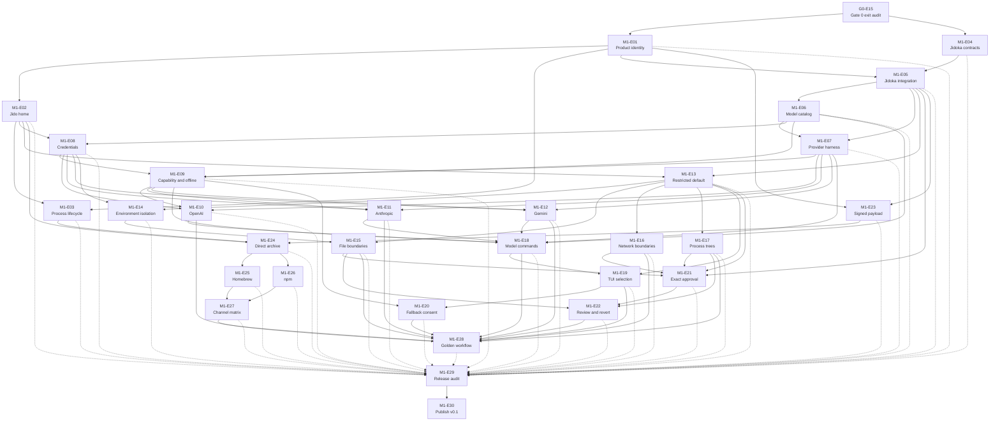

# Milestone 1 Epics

These epics split Milestone 1 into reviewable delivery units. Each epic is complete in exactly one pull request. A pull request must not combine two Milestone 1 epics.

The epic files define scope, epic dependencies, acceptance checks, and proof. Beadwork owns implementation tasks, owners, task dependencies, estimates, and delivery status. Use `bw show <beadwork-id>` to open an imported epic.

## Epic Order

| Epic | Beadwork ID | One-pull-request result | Depends on |
| --- | --- | --- | --- |
| [M1-E01 Product identity](m1-e01-rename-product-identity.md) | `jido_console-m1e01` | Product identifiers change to Jido Console while public interfaces stay compatible. | G0-E15 |
| [M1-E02 Jido home](m1-e02-establish-jido-home.md) | `jido_console-m1e02` | One path service owns the complete local data lifecycle. | M1-E01 |
| [M1-E03 Local process lifecycle](m1-e03-control-local-process-lifecycle.md) | `jido_console-m1e03` | Normal `jido` commands report and stop each owned background process. | M1-E01, M1-E02 |
| [M1-E04 Jidoka execution contracts](m1-e04-land-jidoka-execution-contracts.md) | `jido_console-m1e04` | One Jidoka pull request adds the policy and adapter contracts needed by v0.1. | G0-E15 |
| [M1-E05 Versioned Jidoka integration](m1-e05-integrate-versioned-jidoka.md) | `jido_console-m1e05` | Console uses one approved immutable Jidoka version through public contracts. | M1-E01, M1-E04 |
| [M1-E06 Model support catalog](m1-e06-define-model-support-catalog.md) | `jido_console-m1e06` | One catalog defines support tiers, capabilities, limits, costs, and gaps. | M1-E05 |
| [M1-E07 Provider contract harness](m1-e07-build-provider-contract-harness.md) | `jido_console-m1e07` | One harness produces repeatable provider and model contract evidence. | M1-E05, M1-E06 |
| [M1-E08 Credentials and diagnostics](m1-e08-resolve-credentials-and-diagnose.md) | `jido_console-m1e08` | Declared credential sources and redacted diagnostic commands replace implicit secret handling. | M1-E02, M1-E06 |
| [M1-E09 Capability and offline policy](m1-e09-enforce-capability-and-offline-policy.md) | `jido_console-m1e09` | Unsupported turns stop before execution and offline mode makes no model call. | M1-E06, M1-E07, M1-E08 |
| [M1-E10 OpenAI qualification](m1-e10-qualify-openai-support.md) | `jido_console-m1e10` | Declared OpenAI models pass every claimed contract. | M1-E07, M1-E08, M1-E09 |
| [M1-E11 Anthropic qualification](m1-e11-qualify-anthropic-support.md) | `jido_console-m1e11` | Declared Anthropic models pass every claimed contract. | M1-E07, M1-E08, M1-E09 |
| [M1-E12 Google Gemini qualification](m1-e12-qualify-gemini-support.md) | `jido_console-m1e12` | Declared Google Gemini models pass every claimed contract. | M1-E07, M1-E08, M1-E09 |
| [M1-E13 Restricted execution default](m1-e13-make-restricted-execution-default.md) | `jido_console-m1e13` | Restricted execution becomes the default and trusted-workspace use stays explicit. | M1-E02, M1-E05 |
| [M1-E14 Process environment isolation](m1-e14-isolate-process-environment.md) | `jido_console-m1e14` | Restricted processes get a private home and an explicit environment allowlist. | M1-E08, M1-E13 |
| [M1-E15 File boundaries](m1-e15-enforce-file-boundaries.md) | `jido_console-m1e15` | Restricted processes cannot escape declared roots or follow an escaping symbolic link. | M1-E13, M1-E14 |
| [M1-E16 Network boundaries](m1-e16-enforce-network-boundaries.md) | `jido_console-m1e16` | Undeclared loopback and external network access fail safely. | M1-E13 |
| [M1-E17 Child-process ownership](m1-e17-own-child-process-trees.md) | `jido_console-m1e17` | Every exit path stops the complete owned child-process tree. | M1-E13 |
| [M1-E18 Model commands](m1-e18-add-model-commands.md) | `jido_console-m1e18` | Model list, show, and test commands report exact support data. | M1-E06, M1-E07, M1-E09, M1-E10, M1-E11, M1-E12 |
| [M1-E19 TUI model and profile selection](m1-e19-add-tui-model-profile-selection.md) | `jido_console-m1e19` | The TUI selects and shows the effective model and execution profile. | M1-E13, M1-E18 |
| [M1-E20 Fallback consent](m1-e20-require-fallback-consent.md) | `jido_console-m1e20` | A boundary-changing fallback cannot occur without recorded consent. | M1-E09, M1-E19 |
| [M1-E21 Exact-effect approval](m1-e21-bind-approval-to-effects.md) | `jido_console-m1e21` | Approval applies only to one exact effect identity and normalized parameter set. | M1-E05, M1-E13, M1-E15, M1-E16, M1-E17 |
| [M1-E22 Review and current-run revert](m1-e22-review-and-revert-effects.md) | `jido_console-m1e22` | Exact review, rejection, and current-run revert preserve unrelated user work. | M1-E15, M1-E17, M1-E21 |
| [M1-E23 Signed native payload](m1-e23-build-signed-native-payload.md) | `jido_console-m1e23` | One macOS ARM64 payload has a signature, checksums, an SBOM, and provenance. | M1-E01, M1-E05 |
| [M1-E24 Direct archive preparation](m1-e24-ship-direct-archive.md) | `jido_console-m1e24` | A clean macOS ARM64 system can install, run, update, and remove the direct archive candidate. | M1-E02, M1-E03, M1-E23 |
| [M1-E25 Homebrew preparation](m1-e25-ship-homebrew-channel.md) | `jido_console-m1e25` | A Homebrew candidate installs and manages the exact tested native payload. | M1-E24 |
| [M1-E26 npm preparation](m1-e26-ship-npm-channel.md) | `jido_console-m1e26` | An npm candidate installs the exact native target without compiling or downloading in an install script. | M1-E24 |
| [M1-E27 Channel matrix](m1-e27-verify-channel-matrix.md) | `jido_console-m1e27` | All required v0.1 channel cells pass against one payload identity. | M1-E25, M1-E26 |
| [M1-E28 Golden production workflow](m1-e28-prove-golden-artifact-workflow.md) | `jido_console-m1e28` | The installed production artifact completes the frozen task in restricted mode. | M1-E10, M1-E11, M1-E12, M1-E15, M1-E16, M1-E17, M1-E18, M1-E19, M1-E20, M1-E22, M1-E27 |
| [M1-E29 v0.1 release audit](m1-e29-audit-v0-1-release.md) | `jido_console-m1e29` | One final audit records the v0.1 release decision from complete evidence. | M1-E01 through M1-E28 |
| [M1-E30 v0.1 publication](m1-e30-publish-v0-1-release.md) | `jido_console-m1e30` | The protected workflow publishes and records the approved v0.1 release. | M1-E29 |

## Dependency Diagram

Solid arrows show implementation dependencies. Dashed arrows show that the final release audit directly depends on each prior epic.

## Merge Plan

1. Complete G0-E15. Then run M1-E01 and M1-E04 in parallel.
2. Run M1-E02 after M1-E01. Run M1-E05 after M1-E01 and M1-E04.
3. Run M1-E03, M1-E06, M1-E13, and M1-E23 when their direct dependencies pass.
4. Run M1-E07, M1-E08, M1-E14, M1-E16, M1-E17, and M1-E24 when ready.
5. Run M1-E09, M1-E15, M1-E25, and M1-E26 when ready.
6. Run M1-E10, M1-E11, and M1-E12 in parallel. Run M1-E21 and M1-E27 when ready.
7. Run M1-E18 and M1-E22 when their inputs pass.
8. Run M1-E19, then M1-E20.
9. Run M1-E28 after the provider, model, security, effect, and channel tracks join.
10. Merge M1-E29 after all candidate evidence is complete.
11. Merge M1-E30 last. Its protected workflow publishes and records v0.1.

## Pull Request Rule

Each pull request must link its epic and the [Milestone 1 milestone](../milestone.md). If work cannot fit in one reviewable pull request, split the epic in a roadmap change before implementation starts.
