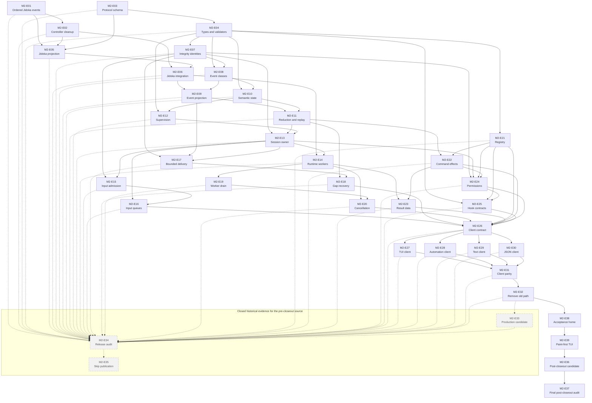

# Milestone 2 Epics

These epics split Milestone 2 into reviewable delivery units. Each epic is complete in exactly one pull request. A pull request must not combine two Milestone 2 epics.

The epic files define scope, epic dependencies, acceptance checks, and proof. Beadwork owns implementation tasks, owners, task dependencies, estimates, and delivery status. Use `bw show <beadwork-id>` to open an imported epic.

## Epic Order

| Epic | Beadwork ID | One-pull-request result | Depends on |
| --- | --- | --- | --- |
| [M2-E01 Ordered Jidoka async events](m2-e01-land-ordered-jidoka-async-events.md) | `jido_console-m2e01` | Jidoka emits one contiguous, single-terminal event stream for each asynchronous request. | — |
| [M2-E02 Jidoka request-controller cleanup](m2-e02-stop-completed-jidoka-request-controllers.md) | `jido_console-m2e02` | Completed asynchronous Jidoka requests leave no request-controller process. | M2-E01 |
| [M2-E03 Canonical session protocol](m2-e03-define-canonical-session-protocol.md) | `jido_console-m2e03` | One versioned schema defines every semantic session message family. | — |
| [M2-E04 Protocol types and validators](m2-e04-generate-protocol-types-and-validators.md) | `jido_console-m2e04` | Generated types and validators stay synchronized with the canonical protocol. | M2-E03 |
| [M2-E05 Portable Jidoka projection](m2-e05-land-portable-jidoka-projection.md) | `jido_console-m2e05` | Jidoka exposes the bounded, redacted projection that Console needs through a public facade. | M2-E01, M2-E02, M2-E03 |
| [M2-E06 Milestone 2 Jidoka integration](m2-e06-pin-and-prove-jidoka-integration.md) | `jido_console-m2e06` | Console pins and proves the approved Jidoka session-plane contract. | M2-E02, M2-E05 |
| [M2-E07 Process-lifetime identities](m2-e07-define-process-lifetime-identities.md) | `jido_console-m2e07` | Every live action, turn, lane, request, approval, control, and client has an exact integrity identity. | M2-E04 |
| [M2-E08 Console event classification](m2-e08-classify-console-events.md) | `jido_console-m2e08` | Every Console event has sequence, durability, sensitivity, origin, and trust data. | M2-E04, M2-E07 |
| [M2-E09 Jidoka event projection](m2-e09-project-jidoka-events.md) | `jido_console-m2e09` | One Console boundary projects Jidoka events without duplicates, invalid order, or runtime leakage. | M2-E06, M2-E08 |
| [M2-E10 Renderer-neutral session state](m2-e10-define-renderer-neutral-session-state.md) | `jido_console-m2e10` | Shared semantic state contains no renderer or live runtime value. | M2-E04, M2-E08 |
| [M2-E11 Semantic reduction and replay](m2-e11-implement-semantic-reduction-and-replay.md) | `jido_console-m2e11` | Live reduction and replay produce the same transcript and outcomes. | M2-E09, M2-E10 |
| [M2-E12 Session supervision topology](m2-e12-add-session-supervision-topology.md) | `jido_console-m2e12` | The application supervises a registry, a dynamic supervisor, and one server for each live session. | M2-E04, M2-E10 |
| [M2-E13 Session-server ownership](m2-e13-make-session-server-the-owner.md) | `jido_console-m2e13` | One session server owns history, active runs, queues, controls, and Console event order. | M2-E07, M2-E11, M2-E12 |
| [M2-E14 Supervised model and tool workers](m2-e14-run-model-and-tool-work-in-workers.md) | `jido_console-m2e14` | Model and tool work runs outside the session owner and returns identity-bound results. | M2-E06, M2-E13 |
| [M2-E15 Process-lifetime input admission](m2-e15-admit-process-lifetime-input.md) | `jido_console-m2e15` | Input is admitted once before an advisory, coalescing wake-up while the application stays alive. | M2-E07, M2-E13 |
| [M2-E16 Steering and follow-up queues](m2-e16-separate-steering-and-follow-up.md) | `jido_console-m2e16` | Active-run steering and next-run input use separate operations and queues. | M2-E13, M2-E15 |
| [M2-E17 Bounded client delivery](m2-e17-bound-client-delivery.md) | `jido_console-m2e17` | A slow or stopped client cannot cause unlimited delivery or mailbox growth. | M2-E07, M2-E09, M2-E13 |
| [M2-E18 Client gap recovery](m2-e18-recover-clients-from-gaps.md) | `jido_console-m2e18` | A client sees an explicit gap and recovers from a current snapshot. | M2-E11, M2-E17 |
| [M2-E19 Exact worker drain](m2-e19-add-exact-worker-drain.md) | `jido_console-m2e19` | Shutdown and tests wait for one exact queued-and-active worker drain condition. | M2-E14 |
| [M2-E20 Two-stage cancellation](m2-e20-add-two-stage-cancellation.md) | `jido_console-m2e20` | Graceful cancellation has a bound and force kill stops the complete owned worker tree. | M2-E14, M2-E19 |
| [M2-E21 Command and client registry](m2-e21-build-command-and-client-registry.md) | `jido_console-m2e21` | One declaration owns commands, help, schemas, permissions, provenance, and client capabilities. | M2-E04 |
| [M2-E22 Typed command effects](m2-e22-return-typed-command-effects.md) | `jido_console-m2e22` | Commands return semantic effects that do not depend on a client or renderer. | M2-E11, M2-E21 |
| [M2-E23 Model and view result data](m2-e23-separate-model-and-view-results.md) | `jido_console-m2e23` | Tool results keep concise model content separate from typed view details. | M2-E14, M2-E22 |
| [M2-E24 Permission life cycle](m2-e24-complete-permission-lifecycle.md) | `jido_console-m2e24` | Permission requests and responses bind exact authority, effect, scope, expiry, cancellation, and audit data. | M2-E07, M2-E13, M2-E21, M2-E22 |
| [M2-E25 Extension and hook contracts](m2-e25-define-extension-and-hook-contracts.md) | `jido_console-m2e25` | Host-independent descriptors declare hooks and their fail-closed or visible-failure rule without loading extensions. | M2-E04, M2-E21, M2-E24 |
| [M2-E26 Session.Client contract](m2-e26-establish-session-client-contract.md) | `jido_console-m2e26` | One client API and behavior suite covers attach, input, output, snapshots, controls, and capabilities. | M2-E16, M2-E18, M2-E20, M2-E21, M2-E22, M2-E23, M2-E24, M2-E25 |
| [M2-E27 TUI client migration](m2-e27-migrate-tui-session-client.md) | `jido_console-m2e27` | The TUI becomes a projection of the supervised session and can detach during work. | M2-E26 |
| [M2-E28 Automation client migration](m2-e28-migrate-automation-session-client.md) | `jido_console-m2e28` | Automation uses Session.Client while its schemas, artifacts, output, and exit status stay compatible. | M2-E26 |
| [M2-E29 Text client migration](m2-e29-migrate-text-session-client.md) | `jido_console-m2e29` | Plain text output becomes a semantic client projection. | M2-E26 |
| [M2-E30 JSON client migration](m2-e30-migrate-json-session-client.md) | `jido_console-m2e30` | JSON output becomes a bounded, versioned semantic client projection. | M2-E26 |
| [M2-E31 Current-client parity](m2-e31-prove-current-client-parity.md) | `jido_console-m2e31` | TUI, automation, text, and JSON pass one contract suite and observe the same ordered outcomes. | M2-E27, M2-E28, M2-E29, M2-E30 |
| [M2-E32 Old TUI path removal](m2-e32-remove-old-tui-session-path.md) | `jido_console-m2e32` | The TUI-owned session and turn path is deleted after parity passes. | M2-E31 |
| [M2-E33 historical v0.2 production candidate](m2-e33-prove-v0-2-production-candidate.md) | `jido_console-m2e33` | Closed evidence for the pre-closeout production candidate. | M2-E32 (historical) |
| [M2-E34 historical v0.2 release audit](m2-e34-audit-v0-2-release.md) | `jido_console-m2e34` | Closed evidence for the pre-closeout v0.2 audit. | M2-E01 through M2-E33 (historical) |
| [M2-E35 historical skipped v0.2 publication](m2-e35-publish-v0-2-release.md) | `jido_console-m2e35` | Closed record of the pre-closeout no-publication decision. | M2-E34 (historical) |
| [M2-E38 isolated release acceptance home](m2-e38-isolate-release-acceptance-home.md) | `jido_console-zs5` | Installed-artifact acceptance uses one private product home in its clean environment. | M2-E32 |
| [M2-E39 paint-first packaged TUI startup](m2-e39-restore-paint-first-packaged-tui-startup.md) | `jido_console-xou` | The packaged TUI paints before slow startup and attaches only after application supervision is ready. | M2-E38 |
| [M2-E36 post-closeout v0.2 candidate](m2-e36-requalify-v0-2-after-closeout.md) | `jido_console-m2e36` | The exact post-closeout candidate passes the session-plane workflow and all common release checks. | M2-E32, M2-E38, M2-E39 |
| [M2-E37 final post-closeout v0.2 audit](m2-e37-reaudit-v0-2-after-closeout.md) | `jido_console-m2e37` | One evidence-only audit records the final v0.2 decision and Milestone 3 baseline. | M2-E36 |

## Dependency Diagram

Solid arrows show the current implementation dependencies. Dashed arrows and
gray nodes show closed historical evidence for the pre-closeout source.
M2-E37 is the final Milestone 2 audit.

## Merge Plan

1. Start from the approved Milestone 1 source baseline. Run M2-E01 and M2-E03
   in parallel. M1-E30 is intentionally not published.
2. Run M2-E02 and M2-E04 when their direct dependencies pass.
3. Run M2-E05 after request cleanup and the protocol schema. Run M2-E07 and M2-E21 after protocol generation.
4. Run M2-E06 after the Jidoka changes. Run M2-E08 after M2-E07.
5. Run M2-E09 and M2-E10 when Jidoka integration and event classification pass.
6. Run M2-E11 and M2-E12 when their semantic inputs pass.
7. Run M2-E13 and M2-E22 when ready.
8. Run M2-E14, M2-E15, and M2-E24 when their direct dependencies pass.
9. Run M2-E16, M2-E19, M2-E23, and M2-E25 when ready. Run M2-E17 only
   after M2-E09, M2-E07, and M2-E13 pass.
10. Run M2-E18 and M2-E20 after delivery and worker control are complete.
11. Run M2-E26 after the queue, delivery, control, registry, result, permission, and hook contracts join.
12. Run M2-E27, M2-E28, M2-E29, and M2-E30 in parallel.
13. Run M2-E31, then remove the old path in M2-E32.
14. Preserve M2-E33, M2-E34, and M2-E35 as closed historical evidence for
    the pre-closeout source. Do not reopen or reuse them for the new source.
15. Repair the clean installed-artifact home in M2-E38 after M2-E32 passes.
16. Restore paint-first supervised packaged TUI startup in M2-E39 after
    M2-E38 passes.
17. Prove the exact post-closeout production candidate in M2-E36 after
    M2-E32, M2-E38, and M2-E39 pass.
18. Merge the evidence-only M2-E37 audit after M2-E36 passes. M2-E37 names
    the final Milestone 2 source baseline for Milestone 3 and reaffirms that
    publication remains skipped. Do not invoke the release workflow.

## Pull Request Rule

Each pull request must link its epic and the [Milestone 2 milestone](../milestone.md). If work cannot fit in one reviewable pull request, split the epic in a roadmap change before implementation starts.
