# Milestone 2: Ship the Semantic and Supervised Session Plane

## Goal

Make every current surface a client of one supervised, renderer-neutral session owner.

## Outcome

The TUI, automation, text, and JSON surfaces use one versioned session protocol and one ordered semantic state. A client can exit and attach again while the application and session stay alive.

This milestone combines the former semantic-core, session-owner, and client-conversion milestones. Internal stages belong in Beadwork and do not make separate releases.

## Delivery Baseline

Milestone 2 starts from the approved Milestone 1 source baseline on `main`.
Deferred public v0.1 publication in M1-E30 does not block Milestone 2 source
work.

## Delivery Policy

Milestone 2 is a source-quality milestone. Production-candidate proof and the
evidence audit are required. M2-E33 through M2-E35 are closed historical
evidence for the source before this closeout work. M2-E36 requalifies the
post-closeout candidate, and M2-E37 is the final audit and Milestone 3
baseline gate. Publication remains intentionally skipped. No epic creates a
tag, package, archive, or public release. The [proof index](proof/README.md)
separates the historical records from the final closeout evidence.

## Generated Epics

The [Milestone 2 epic index](epics/README.md) splits this milestone into 40 epics. Each epic is the scope for exactly one pull request.

## Work

- Land the additive Jidoka fixes for one async event order, request-controller cleanup, and required projection data before Console integration.
- Define a versioned semantic command, event, interaction, outcome, snapshot, replay, and control protocol.
- Project canonical Jidoka events at one boundary and preserve their runtime identities.
- Route every client-visible live update through the canonical Console boundary. Do not send raw Jidoka or runtime events to a client.
- Give each Console event a monotonic sequence, durability class, sensitivity class, origin, and trust data.
- Keep shared semantic state free of renderer data, PIDs, references, functions, and raw runtime structures.
- Keep model and tool work outside the session-owner process.
- Add the Console application supervisor, session registry, dynamic supervisor, and one session server for each live session.
- Make the session server the only owner of history, active runs, queues, control state, and Console event order.
- Bind actions, turns, lanes, requests, approvals, controls, and clients to exact process-lifetime identities.
- Use process-lifetime input admission before an advisory and coalescing wake-up. Do not call this restart-safe or durable admission.
- Separate active-run steering from queued follow-up input.
- Add bounded client delivery, acknowledgement, safe coalescing, explicit gaps, snapshots, and recovery. Bound the receiving process mailbox and copied payload data, not only sender delivery state.
- Use ordered semantic updates for normal live delivery. Use a full snapshot for attach or explicit recovery, not for each ordinary update.
- Add graceful cancel, force kill, and exact worker-drain contracts.
- Put commands, help, schemas, permissions, provenance, and client descriptors in one registry.
- Return typed command effects and separate concise model content from structured view details.
- Define the complete permission request and response life cycle.
- Define a small host-independent extension descriptor and one failure rule for each hook type. Do not load extensions in this milestone.
- Make the production TUI, automation, text, and JSON paths use the same `Session.Client` contract without an adapter-specific runtime-event path.
- Keep the packaged TUI first paint before application and model-catalog
  startup. Start the application supervisors before session attach and process
  registration.
- Keep the native launcher in the npm target package so its private runtime
  stays below the native package root.
- Generate protocol types and validators from one canonical schema and preserve bounded unknown data without granting authority.
- Delete the old TUI-owned session and turn path after parity passes.
- Requalify the exact production candidate after the closeout changes and make
  a new final evidence-only audit before Milestone 3 starts.

## Closeout Sequence

The remaining work has one ordered ownership chain. M2-E28, M2-E29, and
M2-E30 are already complete, but their production paths remain inputs to the
M2-E31 parity proof.

| Epic | Owned result | Must not take |
| --- | --- | --- |
| M2-E09 | Pure Jidoka-to-Console event projection | Client cutover or legacy deletion |
| M2-E17 | Bounded per-attachment delivery and acknowledgement | Snapshot or recovery policy |
| M2-E18 | Attach snapshot and gap-recovery transaction | Public client API or restart recovery |
| M2-E26 | Renderer-neutral client API, behavior, and reusable suite | Production adapter migration |
| M2-E27 | Production TUI cutover and active raw-route removal | Other clients or broad legacy deletion |
| M2-E31 | Production-entry parity proof for all current clients | Product behavior fixes |
| M2-E32 | Isolated legacy deletion and no-return guard | Replacement behavior |
| M2-E38 | Private acceptance home in the clean artifact environment | Product home changes or candidate proof |
| M2-E39 | Paint-first packaged TUI startup with supervised attach | Candidate proof or release publication |
| M2-E40 | npm entry launcher that preserves the native target root | A new channel or candidate proof |
| M2-E36 | Exact post-closeout candidate and artifact proof | Product fixes or publication |
| M2-E37 | Final evidence audit and Milestone 3 baseline | Candidate changes or Milestone 3 planning |

```mermaid
flowchart LR
    E09["M2-E09<br/>Canonical projection"] --> E17["M2-E17<br/>Bounded delivery"]
    E17 --> E18["M2-E18<br/>Gap recovery"]
    E18 --> E26["M2-E26<br/>Client contract"]
    E26 --> E27["M2-E27<br/>TUI cutover"]
    E27 --> E31["M2-E31<br/>Client parity"]
    E31 --> E32["M2-E32<br/>Legacy deletion"]
    E32 --> E38["M2-E38<br/>Acceptance home"]
    E38 --> E39["M2-E39<br/>Paint-first TUI"]
    E39 --> E40["M2-E40<br/>npm native root"]
    E40 --> E36["M2-E36<br/>Candidate proof"]
    E36 --> E37["M2-E37<br/>Final audit"]
```

## Out of Scope

- Application-restart recovery
- A durable input receipt
- LiveView, SSH, and external client deployment
- Multi-user shared documents
- Remote tool execution
- Extension loading and extension process hosting

## Exit Gate

- Jidoka emits one valid ordered stream and normal async completion leaves no request controller.
- Semantic replay produces the same transcript and outcomes as live reduction.
- Duplicate Jidoka events do not create duplicate Console events, and invalid order fails clearly.
- No current client consumes a raw Jidoka or runtime event. All live projections consume canonical Console protocol data through `Session.Client`.
- The TUI can exit during work and attach again while the session continues.
- The production TUI, automation, text, and JSON paths pass one contract suite and observe the same ordered outcomes.
- Automation schemas, artifacts, output, and exit status stay backward-compatible.
- The old TUI-owned session path is deleted.
- The packaged TUI paints within 500 ms before slow startup work and reaches
  runtime readiness within 1,250 ms on the declared warm-run profile.
- The npm entry command runs the native launcher in the target package and
  completes install, first run, update, and removal without compilation.
- A stale, repeated, or cross-session result cannot resolve current work.
- A slow or stopped receiving process stays within the declared mailbox and payload-memory bound, and it can recover after a gap.
- Every client-bound live message uses the bounded delivery path. Ordinary updates do not send repeated full snapshots.
- A client or tool-worker failure does not corrupt or cancel the session unless policy requires it.
- An authority hook fails closed, and an information-only hook failure is visible.
- The milestone states clearly that accepted input can be lost on an application crash before Milestone 3.
- M2-E36 proves the exact post-closeout production candidate, and M2-E37
  audits its exact source, payload, and evidence as the Milestone 3 baseline.
- The common milestone release gate in [the roadmap index](../../README.md#common-milestone-release-gate) passes.

## Release Effect

Record a quality-approved v0.2 source milestone with the canonical supervised
session plane and current-client migration complete. M2-E37 names the exact
audited source baseline for Milestone 3. Do not publish a tag or package.
