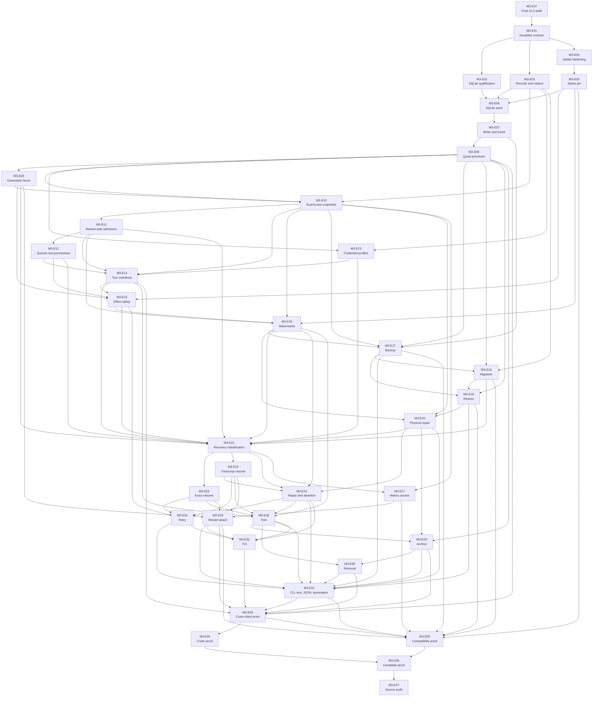

# Milestone 3 Proposed Epics

These 37 specifications split Milestone 3 into reviewable delivery units. Each
approved epic is complete in exactly one pull request. A pull request must not
combine two Milestone 3 epics.

The `jido_console-m3` Beadwork parent contains all 37 epic records. Each epic
file records its verified Beadwork ID. The records are loaded early for work
tracking by explicit user direction. Loading them does not start implementation.

The existing `jido_console-x5b` planning record stays open and blocked by
M2-E37. After that audit, it must compare the preloaded records with the exact
approved source, correct any drift, verify the graph, and close. No
implementation epic can start before that work.

The [Milestone 3 planning baseline](../planning-baseline.md) freezes the local
SQLite layout, record inventory, acknowledgement rules, secret-free profile
boundary, process topology, generation fence, watermark state machine,
operation matrix, crash matrix, exact hard limits, and qualification profile.

## Proposed Epic Order

| Epic | Beadwork ID | One-pull-request result | Depends on |
| --- | --- | --- | --- |
| [M3-E01 Freeze durable continuity contract](m3-e01-freeze-durable-continuity-contract.md) | `jido_console-m3e01` | One contract freezes records, acknowledgements, modes, sensitive-value rules, fences, crash points, and limits. | M2-E37 |
| [M3-E02 Qualify SQLite local store](m3-e02-qualify-sqlite-local-store.md) | `jido_console-m3e02` | One direct SQLite adapter passes package, durability, WAL, reader, temporary-file, and limit checks. | M3-E01 |
| [M3-E03 Define durable records, codecs, and migrations](m3-e03-define-durable-records-codecs-migrations.md) | `jido_console-m3e03` | Versioned Console records, Jidoka envelopes, profile metadata, digests, and migrations have deterministic codecs. | M3-E01 |
| [M3-E04 Harden and qualify Jidoka durable store](m3-e04-qualify-jidoka-durable-store-contract.md) | `jido_console-m3e04` | One upstream Jidoka pull request hardens and proves the public durable-store contract. | M3-E01 |
| [M3-E05 Pin durable Jidoka boundary](m3-e05-pin-prove-durable-jidoka-boundary.md) | `jido_console-m3e05` | Console pins and proves one immutable Jidoka durable contract through its public facade. | M3-E04 |
| [M3-E06 Build default SQLite session store](m3-e06-build-default-sqlite-session-store.md) | `jido_console-m3e06` | One bounded SQLite repository keeps Console and Jidoka truth in separate table families. | M3-E02, M3-E03, M3-E05 |
| [M3-E07 Own durable home and bounded writes](m3-e07-own-durable-home-bound-storage-writes.md) | `jido_console-m3e07` | One home lock and supervised writer own all private bounded writes. | M3-E06 |
| [M3-E08 Add early store quota primitives](m3-e08-add-early-store-quota-primitives.md) | `jido_console-m3e08` | Page, WAL, file-category, tree, and maintenance reservations stop growth before acknowledgement. | M3-E07 |
| [M3-E09 Add durable generation fencing](m3-e09-add-durable-session-generation-fencing.md) | `jido_console-m3e09` | Every old owner, worker, timer, reply, and client is fenced before mutation. | M3-E08 |
| [M3-E10 Persist canonical events and snapshots](m3-e10-persist-canonical-events-bounded-snapshots.md) | `jido_console-m3e10` | Immutable events and bounded rebuildable snapshots survive restart with exact order and digests. | M3-E03, M3-E08, M3-E09 |
| [M3-E11 Admit restart-safe input and commands](m3-e11-admit-restart-safe-input-commands.md) | `jido_console-m3e11` | A sensitive-value check and idempotent receipt commit before each execution wake-up. | M3-E10 |
| [M3-E12 Persist queues, interactions, and permissions](m3-e12-persist-queues-interactions-permissions.md) | `jido_console-m3e12` | Queue order, interactions, permissions, controls, and cancellation restore exactly. | M3-E11 |
| [M3-E13 Add secret-free credential profiles](m3-e13-add-secret-free-credential-profiles.md) | `jido_console-m3e13` | Durable profiles keep only immutable read-only source identities and resolve at the final boundary. | M3-E03, M3-E08 |
| [M3-E14 Persist turn manifests and audit context](m3-e14-persist-turn-manifests-audit-safe-context.md) | `jido_console-m3e14` | Exact model, prompt, tool, skill, workspace, and credential-reference identity survives restart. | M3-E10, M3-E11, M3-E12, M3-E13 |
| [M3-E15 Reserve effects and reconcile uncertainty](m3-e15-reserve-effects-reconcile-uncertainty.md) | `jido_console-m3e15` | Every external effect is reserved before dispatch and an uncertain unsafe effect never repeats automatically. | M3-E05, M3-E09, M3-E12, M3-E14 |
| [M3-E16 Verify Console-to-Jidoka watermarks](m3-e16-verify-console-jidoka-watermarks.md) | `jido_console-m3e16` | One verified watermark joins both durable truths and classifies both orphan cases. | M3-E05, M3-E10, M3-E11, M3-E15 |
| [M3-E17 Back up and verify durable store](m3-e17-back-up-verify-durable-store.md) | `jido_console-m3e17` | A writer-owned SQLite backup becomes usable only after verification, and whole-copy retirement is explicit. | M3-E07, M3-E08, M3-E10, M3-E16 |
| [M3-E18 Migrate durable store](m3-e18-migrate-durable-store.md) | `jido_console-m3e18` | Supported schemas migrate only after a verified backup and future schemas fail before mutation. | M3-E03, M3-E08, M3-E17 |
| [M3-E19 Restore durable store](m3-e19-restore-durable-store.md) | `jido_console-m3e19` | A stopped-store staged replacement preserves the prior image until the new store verifies. | M3-E08, M3-E17, M3-E18 |
| [M3-E20 Quarantine and repair physical store](m3-e20-quarantine-repair-physical-store.md) | `jido_console-m3e20` | Physical faults have dry-run, staged repair, role-safe quarantine, and explicit whole-image retirement. | M3-E10, M3-E16, M3-E19 |
| [M3-E21 Classify sessions behind a recovery gate](m3-e21-recover-sessions-behind-readiness-gate.md) | `jido_console-m3e21` | Bounded coordinators verify, reconcile, rebuild, and return a candidate plan without starting a session owner. | M3-E09, M3-E11, M3-E12, M3-E13, M3-E14, M3-E15, M3-E16, M3-E18, M3-E20 |
| [M3-E22 Add exact resume](m3-e22-add-exact-resume.md) | `jido_console-m3e22` | Verified Console and Jidoka state restores without execution and continues only by explicit request. | M3-E21 |
| [M3-E23 Add transcript-only resume](m3-e23-add-transcript-only-resume.md) | `jido_console-m3e23` | Validated history restores read-only without a runtime continuity claim. | M3-E21 |
| [M3-E24 Add session repair and abandon](m3-e24-add-session-repair-abandon-operations.md) | `jido_console-m3e24` | Supported semantic faults repair explicitly, or unsafe work becomes non-executable and stays auditable. | M3-E16, M3-E20, M3-E21, M3-E23 |
| [M3-E25 Add explicit retry](m3-e25-add-explicit-retry.md) | `jido_console-m3e25` | Retry creates one new request and authority set under the recorded safety policy. | M3-E15, M3-E22, M3-E23, M3-E24 |
| [M3-E26 Add durable session fork](m3-e26-add-durable-session-fork.md) | `jido_console-m3e26` | Exact and transcript-only forks get new identities and no live authority. | M3-E14, M3-E16, M3-E22, M3-E23, M3-E24 |
| [M3-E27 Add bounded durable history access](m3-e27-add-bounded-durable-history-access.md) | `jido_console-m3e27` | Large sessions use a bounded current snapshot and ordered one-megabyte history pages. | M3-E10, M3-E21 |
| [M3-E28 Attach Session.Client after restart](m3-e28-attach-session-client-after-restart.md) | `jido_console-m3e28` | Clients attach in the selected mode with a new generation-bound attachment and no raw path. | M3-E09, M3-E22, M3-E23, M3-E27 |
| [M3-E29 Archive and retain durable sessions](m3-e29-archive-retain-durable-sessions.md) | `jido_console-m3e29` | Verified bounded archives preserve history and fork ancestry before active cleanup. | M3-E08, M3-E20, M3-E26 |
| [M3-E30 Remove durable sessions explicitly](m3-e30-remove-durable-sessions-explicitly.md) | `jido_console-m3e30` | One report-bound confirmation removes stopped session-specific state and blocks on shared store images. | M3-E26, M3-E29 |
| [M3-E31 Add CLI, text, JSON, and automation continuity](m3-e31-add-cli-automation-continuity-operations.md) | `jido_console-m3e31` | Versioned durable operations cover all non-TUI entry points and preserve automation contracts. | M3-E17, M3-E19, M3-E20, M3-E24, M3-E25, M3-E26, M3-E28, M3-E29, M3-E30 |
| [M3-E32 Add TUI continuity](m3-e32-add-tui-continuity-operations.md) | `jido_console-m3e32` | The TUI uses Session.Client and keeps renderer state process local. | M3-E24, M3-E25, M3-E26, M3-E28 |
| [M3-E33 Prove continuity across clients](m3-e33-prove-durable-continuity-across-clients.md) | `jido_console-m3e33` | Provider-free semantic and applicable-administration corpora prove parity, limits, denials, and secret exclusion. | M3-E08, M3-E14, M3-E28, M3-E29, M3-E30, M3-E31, M3-E32 |
| [M3-E34 Prove crash and reconciliation matrix](m3-e34-prove-crash-reconciliation-matrix.md) | `jido_console-m3e34` | Every commit, process, maintenance, orphan, WAL, and stale-generation fault has repeatable proof. | M3-E33 |
| [M3-E35 Prove v0.2-to-v0.3 compatibility](m3-e35-prove-v0-2-v0-3-compatibility.md) | `jido_console-m3e35` | The approved M2 source, home, protocols, clients, Jidoka, backup, migration, and restore remain compatible. | M3-E05, M3-E17, M3-E18, M3-E19, M3-E27, M3-E28, M3-E31, M3-E33 |
| [M3-E36 Prove v0.3 production candidate](m3-e36-prove-v0-3-production-candidate.md) | `jido_console-m3e36` | One exact installed artifact passes all durable, crash, compatibility, and common release gates. | M3-E34, M3-E35 |
| [M3-E37 Audit v0.3 source milestone](m3-e37-audit-v0-3-source-milestone.md) | `jido_console-m3e37` | One evidence-only audit approves or blocks the exact candidate and records skipped publication. | M3-E36 |

## Dependency Diagram

Solid arrows show direct dependencies. M2-E37 is the final Milestone 2 source
and evidence gate. It is not Milestone 3 implementation.

## Merge Plan

1. Finish the Milestone 2 closeout chain through M2-E37. Review can occur
   before that audit, but no Milestone 3 implementation starts.
2. Use `jido_console-x5b` to compare the preloaded records with the approved
   baseline, correct any drift, and verify the graph.
3. Freeze the durability contract in M3-E01.
4. Run SQLite qualification in M3-E02, record work in M3-E03, and the upstream
   Jidoka hardening pull request in M3-E04 in parallel.
5. Pin the approved Jidoka result in M3-E05 and join the three foundations in
   M3-E06.
6. Add the single writer and home owner in M3-E07, then add early quota
   reservations in M3-E08 and generation fencing in M3-E09.
7. Persist canonical events in M3-E10, restart-safe admission in M3-E11, and
   queues and permissions in M3-E12.
8. Add secret-free profiles in M3-E13, turn manifests in M3-E14, effect safety
   in M3-E15, and verified watermarks in M3-E16.
9. Add backup in M3-E17, migration in M3-E18, restore in M3-E19, and physical
   repair in M3-E20 as separate review units.
10. Build bounded recovery classification in M3-E21 without starting a session owner.
11. Consume the candidate plans in exact resume M3-E22 and transcript-only
    resume M3-E23 in parallel.
12. Add semantic repair and abandon in M3-E24, retry in M3-E25, and fork in
    M3-E26.
13. Add bounded history in M3-E27 and restart attachment in M3-E28.
14. Add archive and retention in M3-E29. Keep destructive removal separate in
    M3-E30.
15. Run CLI text, CLI JSON, and automation work in M3-E31 and TUI work in
    M3-E32 in parallel.
16. Prove production-client continuity in M3-E33, then run the full crash
    matrix in M3-E34 and compatibility proof in M3-E35.
17. Build and prove one immutable candidate in M3-E36.
18. Merge the evidence-only M3-E37 audit. Record publication as skipped and,
    if approved, name the exact Milestone 4 baseline.

## Beadwork Load Record

The records were loaded on 2026-08-16 before M2-E37 by explicit user
direction. This early load supports work tracking only.

1. `jido_console-m3` is the parent epic. It is not a one-pull-request delivery
   unit.
2. `jido_console-m3e01` through `jido_console-m3e37` are the 37 child epics.
   Each child has one `parent-child` relation to `jido_console-m3`.
3. Each child has type `epic`, owner `Mike Hostetler`, priority P1, and labels
   `milestone-3`, `one-pr`, `roadmap`, `v0.3`, and
   `policy:no-publication`, plus exactly one reviewed `effort:*` label.
4. M3-E01, M3-E05, M3-E09, M3-E23, M3-E25, M3-E27, and M3-E37 use
   `effort:medium`. The other 30 epics use `effort:large`.
5. The graph has 110 direct `blocks` relations. Only M3-E01 has the direct
   cross-milestone blocker `jido_console-m2e37`.
6. No child implementation tasks were created. Each generated epic remains
   one pull request.
7. `jido_console-x5b` remains open and blocked by M2-E37. After M2-E37, it
   must compare the loaded records with the approved source, correct any
   drift, verify all identifiers and relations, and close before implementation.
8. When M2-E37 and `jido_console-x5b` are complete, `bw ready` must show
   M3-E01 as the only ready Milestone 3 implementation epic.

## Pull Request Rule

Each pull request must link its epic and the
[Milestone 3 milestone](../milestone.md). If work cannot fit in one reviewable
pull request, split the epic in a roadmap change before implementation starts.
